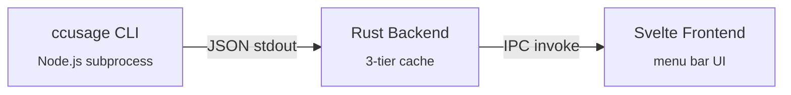

<p align="center">
  
</p>

<h1 align="center">TokenMonitor</h1>

<p align="center">
  <strong>macOS menu bar app for tracking Claude Code &amp; Codex token usage and costs</strong>
</p>

<p align="center">
  
  
  
  
  
  
</p>

---

TokenMonitor lives in your menu bar and gives you real-time visibility into how much you're spending on AI coding assistants. It reads local usage data from [ccusage](https://github.com/ryoppippi/ccusage) — no API keys or cloud accounts required.

## Features

- **Menu bar native** — runs as a tray icon with a popover UI; no dock icon, no window clutter
- **Dual provider support** — toggle between Claude Code and Codex usage with a single click
- **Multiple time views** — 5-hour, daily, weekly, and monthly breakdowns
- **Live cost in tray** — today's running total displayed right in the menu bar (e.g. `$4.72`)
- **Stacked bar charts** — visualize spending trends over time with per-model color coding
- **Per-model breakdown** — see cost and token counts for each model (Opus, Sonnet, Haiku, etc.)
- **3-tier caching** — memory → disk → subprocess hierarchy for instant tab switching
- **Background polling** — data refreshes automatically on a configurable interval
- **Auto-install** — ccusage is installed and updated automatically on first launch
- **Launch at login** — optional autostart via macOS Launch Agent
- **Dark & light themes** — follows system appearance or manual override

## Requirements

- **macOS 13+** (Ventura or later)
- **Node.js ≥ 18** — required for the ccusage data backend
- Active usage of **Claude Code** and/or **Codex CLI** (the tools whose logs are read)

## Installation

### From Source

```bash
# Clone the repository
git clone https://github.com/your-username/TokenMonitor.git
cd TokenMonitor

# Install frontend dependencies
npm install

# Build the app
npx tauri build
```

The `.dmg` installer is output to:

```
src-tauri/target/release/bundle/dmg/TokenMonitor_0.1.0_aarch64.dmg
```

### Development

```bash
npm install
npx tauri dev
```

The app appears as a menu bar icon. Click it to open the popover. See [DEVELOPMENT.md](DEVELOPMENT.md) for the full development guide.

## How It Works



TokenMonitor uses the [ccusage](https://github.com/ryoppippi/ccusage) CLI to parse local Claude Code and Codex session logs, then pipes the JSON output through a Rust caching layer before rendering it in a Svelte-powered popover.

**Cache hierarchy** keeps the UI snappy:

| Tier | Storage | Latency | TTL |
|------|---------|---------|-----|
| 1 | In-memory HashMap | ~ns | 120s |
| 2 | Disk JSON | ~ms | 120s |
| 3 | CLI subprocess | ~6-7s | — |

On cache miss, the CLI is invoked; on CLI failure, stale cache is served for stability.

## Project Structure

```
TokenMonitor/
├── src/                        # Svelte 5 frontend
│   ├── App.svelte              # Root layout & navigation
│   └── lib/
│       ├── components/         # UI components (Chart, MetricsRow, Toggle, etc.)
│       ├── stores/             # Reactive stores + IPC fetch logic
│       ├── types/              # TypeScript interfaces
│       └── utils/              # Formatting helpers & model color map
├── src-tauri/                  # Tauri v2 / Rust backend
│   └── src/
│       ├── lib.rs              # App setup, tray icon, background polling
│       ├── ccusage.rs          # Auto-install, subprocess exec, 3-tier cache
│       ├── commands.rs         # IPC command handlers
│       └── models.rs           # Serde structs for data serialization
├── package.json
├── vite.config.ts
└── DEVELOPMENT.md              # Detailed development guide
```

## Tech Stack

| Layer | Technology |
|-------|-----------|
| Framework | [Tauri v2](https://v2.tauri.app/) |
| Frontend | [Svelte 5](https://svelte.dev/) + TypeScript |
| Backend | Rust 1.93 |
| Data source | [ccusage](https://github.com/ryoppippi/ccusage) CLI |
| Build tool | [Vite 6](https://vitejs.dev/) |
| Plugins | `tauri-plugin-positioner`, `tauri-plugin-store`, `tauri-plugin-autostart` |

## License

This project is licensed under the [GNU General Public License v3.0](LICENSE).
