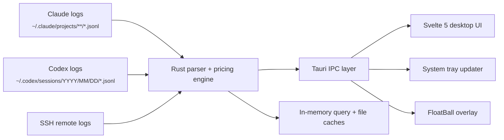

<p align="center">
  
</p>

<h1 align="center">TokenMonitor</h1>

<p align="center">
  <strong>Local-first cross-platform system tray app for monitoring Claude Code and Codex CLI token usage</strong>
</p>

<p align="center">
  A fast, compact way to understand spend, burn rate, model mix, and usage history without leaving the desktop.
</p>

<p align="center">
  
  
  
  
  
  
</p>

<p align="center">
  
</p>

<p align="center">
  <a href="https://github.com/Michael-OvO/TokenMonitor/releases/latest">
    
  </a>
  <a href="https://github.com/Michael-OvO/TokenMonitor/releases/latest">
    
  </a>
  <a href="https://github.com/Michael-OvO/TokenMonitor/releases/latest">
    
  </a>
  <a href="#build-from-source">
    
  </a>
</p>

---

TokenMonitor is a local-first cross-platform system tray app for people who use Claude Code and Codex heavily and want a cleaner, faster way to monitor usage.

It reads the session logs already on your machine, applies provider-aware pricing rules in Rust, and turns them into a compact desktop interface for current-session spend, history, model mix, and rate-limit context.

No API keys. No cloud sync. No runtime dependency on `ccusage` or any other external CLI.

## Quick Install

### Download

Grab the installer for your platform from the [latest release](https://github.com/Michael-OvO/TokenMonitor/releases/latest):

| Platform | Installer | Notes |
|----------|-----------|-------|
| **macOS** | `.dmg` | Open the DMG, drag to Applications |
| **Windows** | `.exe` (NSIS) | Run the installer, follow prompts |
| **Linux** | `.deb` | `sudo dpkg -i token-monitor_*.deb` |

## Features

### Usage Monitoring

- Current-session spend, burn rate, and 5-hour context
- Period views for `5h`, `day`, `week`, `month`, and `year`
- Historical navigation with offset-based browsing
- Claude-only, Codex-only, and merged provider views
- Optional live tray spend display for quick check-ins

### Analysis & Visualization

- Per-model cost and token breakdowns
- Hidden-model filtering
- Bar-chart and line-chart modes
- Calendar heatmap for monthly usage patterns
- Active-session footer with pacing and recent spend context

### Rate Limits & Session Context

- Claude and Codex rate-limit panels when provider data is available
- Utilization, reset timing, cooldown state, and pace hints
- Local fallback paths for rate-limit context when direct provider data is incomplete

### SSH Remote Devices

- Fetch usage logs from remote machines via SSH
- Auto-discover hosts from `~/.ssh/config`
- Per-host sync state and caching
- Unified view merging local and remote usage data

### FloatBall Overlay

- Always-on-top draggable overlay ball showing live spend
- Separate Vite entry point, independent of the main window
- Toggle on/off from settings

### Desktop UX & Settings

- Native system tray popover on all platforms
- Launch-at-login support (LaunchAgent / Registry / XDG autostart)
- Theme, currency, refresh interval, and branding controls
- macOS glass (vibrancy) effect with toggle (opaque on Windows/Linux)
- Integrated settings and calendar panels inside the same popover flow

### Pricing Accuracy

- Native Rust parsing of local session logs with no runtime dependency on `ccusage`
- Claude cache-write pricing separated into 5-minute and 1-hour tiers
- Codex/OpenAI cached input separated from standard input
- Codex `token_count` normalization for both per-turn and cumulative log formats
- Reasoning output folded into output billing where applicable

#### Claude Cache-Write Tiers

| Model | 5m Cache Write | 1h Cache Write | Difference |
|---|---:|---:|---:|
| Opus 4.6 | $6.25 / MTok | $10.00 / MTok | +60% |
| Sonnet 4.6 | $3.75 / MTok | $6.00 / MTok | +60% |
| Haiku 4.5 | $1.25 / MTok | $2.00 / MTok | +60% |

### Local-First & Privacy

- Reads Claude Code and Codex logs already present on disk
- No cloud sync and no remote account required for usage history
- Works passively until local logs exist
- Optional rate-limit panels only use provider-authenticated state already available on the machine

### Performance

- Parsed-file reuse avoids reparsing unchanged logs
- In-memory caches keyed by provider, period, and offset (Arc<RwLock<>>, 2-min TTL)
- Stale-while-revalidate loading for fast repeat views
- Frontend payload cache eliminates IPC round-trips on tab switches
- Adjacent-window warming for quicker historical navigation

## Platform Differences

| Feature | macOS | Windows | Linux |
|---------|-------|---------|-------|
| System tray icon | Menu bar | System tray | System tray |
| Cost display | `set_title()` text beside icon | Tooltip on hover | Tooltip on hover |
| Rate limits (Claude) | OAuth via Keychain + API, CLI probe fallback | CLI probe only | CLI probe only |
| Rate limits (Codex) | JSONL session files | JSONL session files | JSONL session files |
| Glass blur effect | Supported (toggle in Settings) | Not available (opaque) | Not available (opaque) |
| Dock icon toggle | Supported | Not applicable | Not applicable |
| Autostart | LaunchAgent | Registry | XDG autostart |
| Installer | DMG (signed + notarized) | NSIS .exe | .deb package |

## Local Data

TokenMonitor works from usage data you already have on disk. If no logs are present yet, the app stays idle until Claude Code or Codex generates them.

### Usage History

| Provider | Default path | Discovery behavior |
|---|---|---|
| Claude Code | `~/.claude/projects/**/*.jsonl` | Also checks `$CLAUDE_CONFIG_DIR/projects` when set |
| Codex CLI | `~/.codex/sessions/YYYY/MM/DD/*.jsonl` | Also respects `$CODEX_HOME/sessions` when set |

### Rate-Limit Data

Rate-limit visibility is separate from usage history parsing:

- Claude rate limits use local authentication state already on the machine and fall back to CLI probe when needed
- Codex rate limits are read from recent session metadata in local Codex JSONL files

## Installation

### Download

Grab the latest installer from the [Releases](https://github.com/Michael-OvO/TokenMonitor/releases/latest) page.

### Build From Source

**Prerequisites:**

- Node.js >= 18 and npm
- Rust toolchain (install via [rustup](https://rustup.rs/))
- Platform-specific Tauri dependencies:
  - **macOS**: Xcode Command Line Tools (`xcode-select --install`)
  - **Windows**: Visual Studio C++ Build Tools, WebView2 (pre-installed on Windows 11)
  - **Linux**: `sudo apt install libwebkit2gtk-4.1-dev libappindicator3-dev librsvg2-dev patchelf`

```bash
git clone https://github.com/Michael-OvO/TokenMonitor.git
cd TokenMonitor
npm install
npx tauri build
```

Platform-specific bundle output:

| Platform | Output |
|----------|--------|
| macOS | `src-tauri/target/release/bundle/dmg/TokenMonitor_x.y.z_aarch64.dmg` |
| Windows | `src-tauri/target/release/bundle/nsis/TokenMonitor_x.y.z_x64-setup.exe` |
| Linux | `src-tauri/target/release/bundle/deb/token-monitor_x.y.z_amd64.deb` |

### Development

```bash
npm install
npx tauri dev          # full app: hot-reload frontend + debug Rust backend
npm run dev            # frontend only at http://localhost:1420 (no Rust)
```

### Testing

```bash
npm test               # vitest (frontend unit tests)
npm run test:rust      # cargo test (Rust backend tests)
npm run test:all       # both Rust and frontend tests sequentially
```

## Architecture



### Project Structure

```text
src/
├── App.svelte                     # Main popover shell and view orchestration
├── float-ball.ts                  # FloatBall entry point
└── lib/
    ├── bootstrap.ts               # Startup wiring and runtime initialization
    ├── stores/
    │   ├── usage.ts               # Usage fetching, in-memory cache, period/provider state
    │   ├── rateLimits.ts          # Rate-limit fetching and persistence
    │   └── settings.ts            # Theme, tray, currency, and local preferences
    ├── providerMetadata.ts        # Central usage/rate-limit provider metadata for the UI
    ├── components/                # Metrics, charts, calendar, footer, settings UI
    │   ├── Chart.svelte           # Bar/line chart visualization
    │   ├── Breakdown.svelte       # Per-model cost breakdown
    │   ├── Calendar.svelte        # Heatmap calendar view
    │   ├── DevicesView.svelte     # SSH remote device management
    │   ├── FloatBall.svelte       # Always-on-top overlay component
    │   ├── Footer.svelte          # Active session, burn rate
    │   ├── Settings.svelte        # Settings panel
    │   └── UsageBars.svelte       # Rate limit utilization bars
    ├── tray/
    │   ├── sync.ts                # Frontend-to-native tray state syncing
    │   └── title.ts               # Tray title formatting
    ├── views/                     # View-model logic (footer, rate limits, devices)
    ├── window/
    │   ├── appearance.ts          # Window surface syncing
    │   └── sizing.ts              # Window size management
    └── utils/
        ├── platform.ts            # OS detection (macOS/Windows/Linux)
        ├── calendar.ts            # Calendar utilities
        ├── format.ts              # Number/currency formatting
        └── logger.ts              # Frontend logging via Rust file writer

src-tauri/src/
├── lib.rs                         # Tauri app setup, tray wiring, background refresh
├── commands.rs                    # IPC dispatch hub
│   └── commands/
│       ├── usage_query.rs         # Data fetching
│       ├── calendar.rs            # Heatmap queries
│       ├── period.rs              # Time range selection
│       ├── config.rs              # Settings sync
│       ├── tray.rs                # Title/utilization rendering
│       ├── ssh.rs                 # Remote device management
│       ├── float_ball.rs          # Overlay state
│       └── logging.rs             # Log-level control
├── logging.rs                     # tracing + rolling file appender
├── models.rs                      # Shared backend payload types
├── usage/
│   ├── parser.rs                  # JSONL discovery, parsing, normalization
│   ├── pricing.rs                 # Model-family-aware token pricing
│   ├── integrations.rs            # Usage integration registry
│   ├── ssh_remote.rs              # SSH remote log sync
│   └── ssh_config.rs              # SSH host discovery
├── rate_limits/
│   ├── claude.rs                  # OAuth Keychain + API (macOS)
│   ├── claude_cli.rs              # CLI probe fallback (all platforms)
│   ├── codex.rs                   # Session file parsing
│   └── http.rs                    # Shared HTTP client
├── tray/
│   └── render.rs                  # Native tray icon + utilization bars (RGBA)
├── stats/
│   ├── change.rs                  # Change statistics
│   └── subagent.rs                # Subagent statistics
└── platform/
    ├── mod.rs                     # Cross-platform helpers
    ├── macos/                     # macOS window management
    ├── windows/
    │   ├── taskbar.rs             # GDI taskbar panel
    │   └── window.rs              # Taskbar-aligned positioning
    └── linux/                     # Linux window management
```

### Runtime Flow

1. The UI requests a provider, period, and optional historical offset through Tauri IPC.
2. The Rust backend resolves one or more usage integrations, scans their JSONL logs, normalizes integration-specific events, and prices each entry locally.
3. Aggregated payloads are cached in memory for fast repeat requests.
4. The frontend renders metrics, charts, model summaries, calendar views, and footer state.
5. A background loop refreshes the tray title and emits update events on the configured interval.

### Tech Stack

| Layer | Technology |
|---|---|
| Desktop shell | [Tauri v2](https://v2.tauri.app/) |
| Frontend | [Svelte 5](https://svelte.dev/) + TypeScript |
| Backend | Rust |
| Build tool | [Vite 6](https://vitejs.dev/) |
| State path | Local JSONL parsing + Tauri IPC + Svelte stores |

## For Builders

<details>
<summary>Validation, benchmarks, and versioning</summary>

### Validation

```bash
npx svelte-check                # Svelte type checking
npm test                        # Vitest
cd src-tauri && cargo fmt --check       # Rust format
cd src-tauri && cargo clippy -- -D warnings  # Rust lints
cd src-tauri && cargo test      # Rust tests
```

Convenience command:

```bash
npm run test:all
```

### Manual Cache Benchmark

There is an ignored Rust benchmark test for the integrated caching paths:

```bash
cargo test benchmark_real_log_cache_paths --manifest-path src-tauri/Cargo.toml -- --ignored --nocapture
```

### Versioning

Version must stay in sync across three files: `package.json`, `src-tauri/Cargo.toml`, `src-tauri/tauri.conf.json`.

```bash
npm run release -- X.Y.Z    # bumps all 3 files, commits, tags, pushes
```

Tag push triggers GitHub Actions release workflow which builds for all three platforms.

</details>

## Contributing

Issues and pull requests are welcome, especially around:

- UI polish and distinctive tray workflows
- Pricing-model accuracy
- Performance on large local histories
- Packaging and distribution
- New provider support
- Cross-platform compatibility

If you use Claude Code or Codex heavily, this repo is intended to be a practical local utility and a solid foundation for usage observability across macOS, Windows, and Linux.

## License

Licensed under the [GNU General Public License v3.0](LICENSE).
