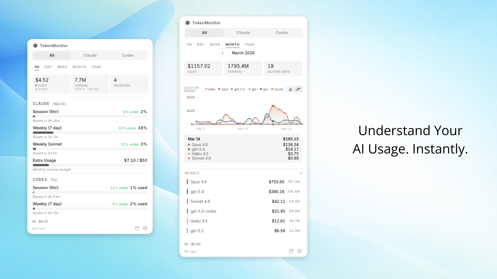
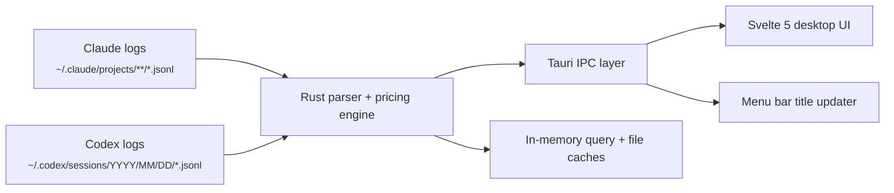

<p align="center">
  
</p>

<h1 align="center">TokenMonitor</h1>

<p align="center">
  <strong>Local-first macOS menu bar usage monitor for Claude Code and Codex</strong>
</p>

<p align="center">
  A fast, compact way to understand spend, burn rate, model mix, and usage history without leaving the desktop.
</p>

<p align="center">
  
  
  
  
  
  
</p>

<p align="center">
  
</p>

---

TokenMonitor is a local-first macOS menu bar app for people who use Claude Code and Codex heavily and want a cleaner, faster way to monitor usage.

It reads the session logs already on your machine, applies provider-aware pricing rules, and turns them into a compact macOS interface for current-session spend, history, model mix, and rate-limit context.

No API keys. No cloud sync. No runtime dependency on `ccusage` or another external usage CLI for usage parsing.

## Features

### Usage Monitoring

- Current-session spend, burn rate, and 5-hour context
- Period views for `5h`, `day`, `week`, `month`, and `year`
- Historical navigation with offset-based browsing
- Claude-only, Codex-only, and merged provider views
- Optional live tray spend display for quick menu bar check-ins

### Analysis & Visualization

- Per-model cost and token breakdowns
- Hidden-model filtering
- Bar-chart and line-chart modes
- Calendar heatmap for monthly usage patterns
- Active-session footer with pacing and recent spend context

### Rate Limits & Session Context

- Claude and Codex rate-limit panels when provider data is available
- Utilization, reset timing, cooldown state, and pace hints
- Local fallback paths for rate-limit context when direct provider data is incomplete

### Desktop UX & Settings

- Native macOS menu bar popover workflow
- Launch-at-login support
- Theme, currency, refresh interval, and branding controls
- Integrated settings and calendar panels inside the same popover flow

### Pricing Accuracy

- Native Rust parsing of local session logs with no runtime dependency on `ccusage`
- Claude cache-write pricing separated into 5-minute and 1-hour tiers
- Codex/OpenAI cached input separated from standard input
- Codex `token_count` normalization for both per-turn and cumulative log formats
- Reasoning output folded into output billing where applicable

#### Claude Cache-Write Tiers

| Model | 5m Cache Write | 1h Cache Write | Difference |
|---|---:|---:|---:|
| Opus 4.6 | $6.25 / MTok | $10.00 / MTok | +60% |
| Sonnet 4.6 | $3.75 / MTok | $6.00 / MTok | +60% |
| Haiku 4.5 | $1.25 / MTok | $2.00 / MTok | +60% |

### Local-First & Privacy

- Reads Claude Code and Codex logs already present on disk
- No cloud sync and no remote account required for usage history
- Works passively until local logs exist
- Optional rate-limit panels only use provider-authenticated state already available on the machine

### Performance

- Parsed-file reuse avoids reparsing unchanged logs
- In-memory caches keyed by provider, period, and offset
- Stale-while-revalidate loading for fast repeat views
- Adjacent-window warming for quicker historical navigation

## Local Data

TokenMonitor works from usage data you already have on disk. If no logs are present yet, the app stays idle until Claude Code or Codex generates them.

### Usage History

| Provider | Default path | Discovery behavior |
|---|---|---|
| Claude Code | `~/.claude/projects/**/*.jsonl` | Also checks `$CLAUDE_CONFIG_DIR/projects` when set |
| Codex CLI | `~/.codex/sessions/YYYY/MM/DD/*.jsonl` | Also respects `$CODEX_HOME/sessions` when set |

### Rate-Limit Data

Rate-limit visibility is separate from usage history parsing:

- Claude rate limits use the local Claude authentication state already present on the machine and fall back to Claude CLI rate-limit events when needed
- Codex rate limits are read from recent session metadata in local Codex JSONL files

Usage history and cost analytics stay local. Optional rate-limit panels may use authenticated provider data already available on the machine.

## Installation

### Build From Source

```bash
git clone https://github.com/Michael-OvO/TokenMonitor.git
cd TokenMonitor
npm install
npx tauri build
```

Bundle output:

```text
src-tauri/target/release/bundle/
```

### Development

```bash
npm install
npx tauri dev
```

The app runs as a menu bar utility. Click the tray icon to open the popover.

## Requirements

- macOS 13 or newer
- Existing Claude Code and/or Codex usage logs on disk
- Node.js 18+ and Rust toolchain only if you are building from source

## Architecture



### Core Modules

```text
src/
├── App.svelte                   # Main popover shell and view orchestration
└── lib/
    ├── bootstrap.ts            # Startup wiring and runtime initialization
    ├── stores/
    │   ├── usage.ts            # Usage fetching, in-memory cache, period/provider state
    │   ├── rateLimits.ts       # Rate-limit fetching and persistence
    │   └── settings.ts         # Theme, tray, currency, and local preferences
    ├── components/             # Metrics, charts, calendar, footer, settings UI
    ├── traySync.ts             # Frontend-to-native tray state syncing
    └── windowAppearance.ts     # macOS window surface syncing

src-tauri/src/
├── lib.rs                      # Tauri app setup, tray wiring, background refresh
├── commands.rs                 # IPC commands exposed to the frontend
├── parser.rs                   # Claude/Codex JSONL discovery, parsing, normalization
├── pricing.rs                  # Provider-aware token pricing and cache-write billing
├── rate_limits.rs              # Claude/Codex rate-limit acquisition and shaping
├── tray_render.rs              # Native tray title and icon rendering
└── models.rs                   # Shared backend payload types
```

### Runtime Flow

1. The UI requests a provider, period, and optional historical offset through Tauri IPC.
2. The Rust backend scans relevant JSONL logs, normalizes provider-specific events, and prices each entry locally.
3. Aggregated payloads are cached in memory for fast repeat requests.
4. The frontend renders metrics, charts, model summaries, calendar views, and footer state.
5. A background loop refreshes the tray title and emits update events on the configured interval.

### Parsing Notes

- Claude parsing skips non-assistant entries and intermediate streaming noise
- Codex parsing normalizes both per-turn and cumulative `token_count` events into deltas
- Cross-provider merge mode preserves period semantics while combining totals
- Historical navigation is offset-based, which keeps the UI simple while letting the backend stay date-aware

### UI Architecture

- `App.svelte` coordinates provider, period, offset, settings, and view switches
- Svelte stores own fetch lifecycle, stale-while-revalidate caching, and persisted settings
- UI components stay relatively dumb: charts, model lists, calendar, footer, and settings render from store payloads
- Native-only concerns such as tray rendering and window surface behavior stay in the Tauri layer rather than leaking through the component tree

## For Builders

<details>
<summary>Validation, project structure, and stack</summary>

### Validation

```bash
./node_modules/.bin/tsc --noEmit
npm test -- --run
npm run build
cargo clippy --manifest-path src-tauri/Cargo.toml --all-targets -- -D warnings
cargo test --manifest-path src-tauri/Cargo.toml
```

Convenience command:

```bash
npm run test:all
```

### Project Structure

```text
TokenMonitor/
├── src/
│   ├── App.svelte
│   └── lib/
│       ├── bootstrap.ts
│       ├── components/
│       ├── stores/
│       ├── types/
│       └── utils/
├── src-tauri/
│   └── src/
│       ├── commands.rs
│       ├── lib.rs
│       ├── models.rs
│       ├── parser.rs
│       ├── pricing.rs
│       └── rate_limits.rs
├── docs/
├── DEVELOPMENT.md
├── package.json
└── README.md
```

### Tech Stack

| Layer | Technology |
|---|---|
| Desktop shell | [Tauri v2](https://v2.tauri.app/) |
| Frontend | [Svelte 5](https://svelte.dev/) + TypeScript |
| Backend | Rust |
| Build tool | [Vite 6](https://vitejs.dev/) |
| State path | Local JSONL parsing + Tauri IPC + Svelte stores |

</details>

## Contributing

Issues and pull requests are welcome, especially around:

- UI polish and distinctive menu bar workflows
- pricing-model accuracy
- performance on large local histories
- packaging and distribution
- new provider support

If you use Claude Code or Codex heavily, this repo is intended to be a practical local utility and a solid foundation for usage observability on macOS.

## License

Licensed under the [GNU General Public License v3.0](LICENSE).
