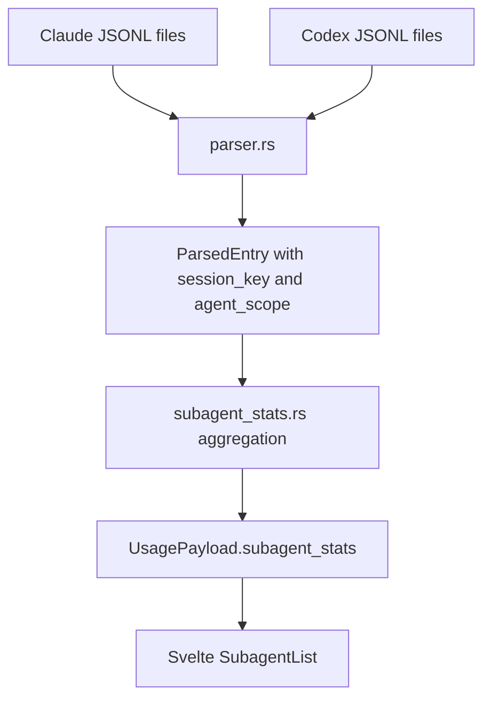

# Design: Subagent Usage Attribution from Claude Code and Codex Logs

Status: Proposed

Owner: TokenMonitor

Last Updated: 2026-03-21

## Summary

Add a new local-first usage breakdown that separates `main` agent activity from `subagent` activity for both Claude Code and Codex.

The current app already reads the right log trees:

- Claude: `~/.claude/projects/**/*.jsonl`
- Codex: `~/.codex/sessions/YYYY/MM/DD/*.jsonl`

But it does not preserve the metadata needed to attribute usage to subagents. In practice:

- Claude subagent usage is already being counted in total Claude usage because the parser recursively scans `subagents/agent-*.jsonl`, but the app cannot break it back out.
- Codex subagent usage is not distinguishable today because the parser ignores `session_meta.payload.source.subagent`.

This design adds a small, explicit `subagent_stats` object to `UsagePayload`, backed by parser-level `agent_scope` attribution on each parsed entry.

V1 intentionally keeps the product surface simple:

- show `Main` vs `Subagents`
- preserve existing totals, charts, and model breakdowns
- avoid per-subagent naming, grouping, or drill-down in the first release

Phase 2 can add named subagent runs and per-subagent change stats if the V1 binary split proves useful.

## Problem

Power users increasingly delegate work to sidecar agents, spawned workers, and provider-internal helper agents. TokenMonitor currently answers:

- how much was spent
- how many tokens were used
- which models were used

It does not answer:

- how much of that usage came from the main agent vs delegated subagents
- whether a high-cost session was expensive because the main thread was large or because many subagents were spawned
- whether Claude and Codex behave differently in delegated workflows

Without this split, the usage totals are directionally correct but operationally incomplete.

## Current State

### Claude Code

The Claude parser recursively scans the full projects tree with `glob_jsonl_files`, so it already includes nested subagent files under paths like:

`~/.claude/projects/<project>/<session>/subagents/agent-<id>.jsonl`

Those files contain:

- `isSidechain: true`
- `agentId`
- `sessionId`
- optional `slug`
- normal assistant `message.usage` payloads

Implication: Claude subagent usage is already folded into total usage, but attribution is lost.

### Codex

Codex session files include a `session_meta` line with file-level source metadata and then regular `token_count` events in the same file.

Observed subagent metadata shapes include:

- `source: {"subagent":{"other":"guardian"}}`
- `source: {"subagent":{"thread_spawn":{"parent_thread_id":"...","depth":1,"agent_nickname":"Linnaeus","agent_role":"worker"}}}`

The current parser reads:

- `turn_context`
- tool call events
- `token_count`

It ignores `session_meta`, so subagent source information is discarded before aggregation.

Implication: Codex totals are correct, but the app cannot distinguish root sessions from subagent sessions.

## Goals

- Add a reliable `main` vs `subagent` usage split for Claude and Codex.
- Preserve current provider and period semantics.
- Keep the feature fully local and log-derived.
- Reuse the existing parser cache and pricing logic.
- Make the V1 UI additive and low-risk.

## Non-Goals

- Named per-subagent reporting in V1.
- Stable cross-session identity for Claude sidechains.
- Chart segmentation by subagent in V1.
- Rate-limit attribution by subagent.
- Semantic attribution of shell-edited files to a subagent.
- Changing how top-line totals are computed.

## Source Capability Matrix

| Provider | Signal | Available in logs | Confidence | V1 use |
|---|---|---:|---:|---:|
| Claude | `isSidechain` | Yes | High | Yes |
| Claude | `agentId` | Yes | High | Internal only |
| Claude | `sessionId` | Yes | High | Yes |
| Claude | `slug` | Sometimes | Medium | Phase 2 |
| Claude | per-message usage | Yes | High | Yes |
| Codex | `session_meta.payload.id` | Yes | High | Yes |
| Codex | `session_meta.payload.source.subagent` | Yes | High | Yes |
| Codex | thread spawn role/nickname | Sometimes | Medium | Phase 2 |
| Codex | per-event token deltas | Yes | High | Yes |

## Representative Log Shapes

### Claude subagent file

```json
{"isSidechain":true,"agentId":"aaa0a13","sessionId":"b2a9eb19-c978-4d36-9058-7916fcd642f8","type":"assistant","message":{"usage":{"input_tokens":3,"cache_creation_input_tokens":12949,"cache_read_input_tokens":0,"output_tokens":1}}}
```

### Codex subagent session

```json
{"type":"session_meta","payload":{"id":"019ceda7-0cb4-7572-9cee-f10968985562","source":{"subagent":{"thread_spawn":{"parent_thread_id":"019ce8ea-557f-7d90-8d9a-6e8375389dc5","depth":1,"agent_nickname":"Linnaeus","agent_role":"worker"}}}}}
{"type":"event_msg","payload":{"type":"token_count","info":{"last_token_usage":{"input_tokens":34614,"cached_input_tokens":2432,"output_tokens":278}}}}
```

## V1 Product Behavior

### UX

Add a new `Subagents` section below `ModelList` when the selected payload contains any subagent usage.

The section shows two rows:

- `Main`
- `Subagents`

Each row shows:

- cost
- total tokens
- optional percentage of total cost

Example:

```text
Subagents
Main        $18.42   512K
Subagents    $4.91   141K   21%
```

### Visibility rules

- If `subagents.total_tokens == 0` and `subagents.cost == 0`, hide the section entirely.
- Show the section for all periods, including `5h`.
- In the `all` provider tab, merge Claude and Codex into one binary split. Provider-specific detail remains available via the provider tabs.

### Out of scope for V1

- named rows like `guardian`, `worker:Linnaeus`, or `agent-a33387d`
- expandable drill-down
- per-subagent change statistics

## Data Model

### Frontend payload

Add a new nullable field to `UsagePayload`:

```ts
interface UsagePayload {
  // existing fields
  subagent_stats: SubagentStats | null;
}

interface SubagentStats {
  main: ScopeUsageSummary;
  subagents: ScopeUsageSummary;
}

interface ScopeUsageSummary {
  cost: number;
  tokens: number;
  input_tokens: number;
  output_tokens: number;
  cache_read_tokens: number;
  cache_write_tokens: number;
  session_count: number;
  pct_of_total_cost: number | null;
}
```

Notes:

- `cache_write_tokens` maps to Claude cache creation tokens and should be `0` for Codex in V1.
- `session_count` means distinct log sessions, not number of assistant messages.
- `pct_of_total_cost` is derived in backend for convenience and stable display.

### Internal parser model

Extend `ParsedEntry` with:

```rust
pub enum AgentScope {
    Main,
    Subagent,
}

pub struct ParsedEntry {
    // existing fields
    pub session_key: String,
    pub agent_scope: AgentScope,
}
```

Why both fields are needed:

- `agent_scope` drives the actual main vs subagent aggregation
- `session_key` is required to compute distinct session counts correctly

V1 does not require `ParsedChangeEvent` changes.

## Parsing Design



### Claude parsing changes

Add these fields to `ClaudeJsonlEntry`:

- `sessionId`
- `isSidechain`
- `agentId`
- `slug`

Rules:

- `isSidechain == true` => `agent_scope = Subagent`
- otherwise => `agent_scope = Main`
- `session_key = "claude:" + sessionId + ":" + ("subagent:" + agentId | "main")`

Important dedupe fix:

The current Claude dedupe hash is built from `message.id + requestId`. For subagent-aware parsing, this should become:

`session_key + ":" + message.id + ":" + requestId`

This avoids a subtle failure mode where a root session file and a sidechain file produce the same `(message.id, requestId)` pair and one entry gets dropped during recursive dedupe.

### Codex parsing changes

Add a lightweight `session_meta` parse path before the existing `turn_context` / `token_count` logic.

New file-level state inside `parse_codex_session_file`:

- `session_key`
- `agent_scope`

Rules:

- no `source.subagent` => `agent_scope = Main`
- any present `source.subagent` => `agent_scope = Subagent`
- `session_key = "codex:" + payload.id` when available
- fallback `session_key = "codex-file:" + absolute_file_path`

Important detail:

Codex subagent attribution is file-level, not per-event. The parser should read `session_meta` once, cache the result for the remainder of the file, and apply the same `agent_scope` to every emitted `ParsedEntry` from that file.

### Compatibility behavior

Older or incomplete logs should default to:

- `agent_scope = Main`
- `session_key = provider + file-path fallback`

This keeps historical usage visible and avoids making attribution a hard requirement for parsing.

## Aggregation Rules

Create a new backend module:

- `src-tauri/src/subagent_stats.rs`

Responsibilities:

- define `SubagentStats` and `ScopeUsageSummary`
- aggregate `ParsedEntry` slices into `main` and `subagents`
- compute distinct session counts
- compute cost share

Signature:

```rust
pub fn aggregate_subagent_stats(
    entries: &[ParsedEntry],
    total_cost: f64,
    total_tokens: u64,
) -> Option<SubagentStats>
```

Aggregation algorithm:

1. Partition entries by `agent_scope`.
2. Sum:
   - cost
   - total tokens
   - input tokens
   - output tokens
   - cache read tokens
   - cache write tokens
3. Count distinct `session_key` values per scope.
4. Compute `pct_of_total_cost` when `total_cost > 0`.

Cost computation must reuse the same pricing helper already used for chart buckets and model breakdown. No new pricing table is allowed.

## Merge Semantics

### Provider tabs

- `claude` => aggregate only Claude entries
- `codex` => aggregate only Codex entries

### `all` tab

The `all` tab must merge `subagent_stats` additively:

- `main = claude.main + codex.main`
- `subagents = claude.subagents + codex.subagents`

`pct_of_total_cost` should be recomputed after merge, not summed.

## UI Design

### New component

Create:

- `src/lib/components/SubagentList.svelte`

Props:

```ts
interface Props {
  stats: SubagentStats;
}
```

Behavior:

- show a header `Subagents`
- render `Main` first, `Subagents` second
- sort is fixed, not data-driven
- use existing `formatCost` and `formatTokens`
- render percentage only on the `Subagents` row and only when non-null

### Placement

In `App.svelte`:

- render the section below `ModelList`
- add a divider only when the section is shown

### Styling

Do not invent a new visual system.

Reuse the current list-row language from `ModelList`:

- same padding rhythm
- same numeric typography
- subtle hover background

The only new styling should be a small muted scope badge or row label emphasis if needed.

## File Map

### New files

| File | Responsibility |
|---|---|
| `src-tauri/src/subagent_stats.rs` | Aggregation types and helpers |
| `src/lib/components/SubagentList.svelte` | Main vs subagent UI rows |

### Modified files

| File | What changes |
|---|---|
| `src-tauri/src/lib.rs` | Add `mod subagent_stats;` |
| `src-tauri/src/models.rs` | Add `subagent_stats` to `UsagePayload` |
| `src-tauri/src/parser.rs` | Add `session_key` and `agent_scope` to `ParsedEntry`; parse Claude sidechain fields and Codex `session_meta` |
| `src-tauri/src/commands.rs` | Attach aggregated `subagent_stats` to provider payloads and merged payloads |
| `src/lib/types/index.ts` | Add `SubagentStats` and `ScopeUsageSummary` interfaces |
| `src/App.svelte` | Render `SubagentList` |

## Testing Plan

### Rust parser tests

Add focused tests for:

1. Claude root session entry defaults to `AgentScope::Main`.
2. Claude subagent file with `isSidechain: true` maps to `AgentScope::Subagent`.
3. Claude recursive dedupe does not collapse root and sidechain entries that share the same message/request identifiers.
4. Codex file with no `session_meta.source.subagent` maps to `AgentScope::Main`.
5. Codex file with `source.subagent.other` maps to `AgentScope::Subagent`.
6. Codex file with `source.subagent.thread_spawn` maps to `AgentScope::Subagent`.
7. Distinct `session_key` counting reports one session even when many assistant entries exist in the same file.

### Aggregation tests

Add tests for:

1. main-only usage returns `subagents` as all-zero but still valid
2. mixed main and subagent usage splits cost and token totals correctly
3. merged `all` payload recomputes percentages correctly
4. zero-total-cost payload leaves `pct_of_total_cost` as `null`

### Frontend tests

Add Svelte/Vitest coverage for:

1. section hidden when subagent totals are zero
2. section renders both rows when subagent usage exists
3. percentage formatting on the `Subagents` row

## Risks and Edge Cases

### Claude sidechain files are already included in totals

This is the most important behavioral note.

The feature should not add new Claude usage. It should only decompose existing totals into:

- main
- subagents

If totals change after the feature lands, the parser has regressed.

### Codex `session_meta` schema may evolve

The parser should treat `source.subagent` as an opaque presence check in V1:

- present => subagent
- absent => main

Do not hardcode the `thread_spawn` shape into the V1 product logic.

### Old logs

Some older logs may not have the newer metadata fields. The fallback must always be `Main`.

### Zero-token subagent sessions

Some session files may contain setup metadata but no meaningful token usage. They should not surface the section by themselves because the UI is driven by aggregated totals, not by metadata presence.

## Rollout Strategy

### V1

- backend attribution
- binary `Main` vs `Subagents` payload field
- simple UI section

### Phase 2

After V1 is stable, consider:

- named subagent drill-down
- provider-specific badges in the `all` tab
- subagent change statistics using `ParsedChangeEvent`
- optional sorting by cost share or token share

## Acceptance Criteria

The feature is complete when:

1. `UsagePayload` includes `subagent_stats` for `claude`, `codex`, and `all`.
2. Claude totals remain unchanged before vs after the feature.
3. Codex sessions with `session_meta.payload.source.subagent` are counted under `subagents`.
4. The UI clearly shows `Main` vs `Subagents` when delegated usage exists.
5. No chart, rate-limit, or model-breakdown regressions are introduced.
